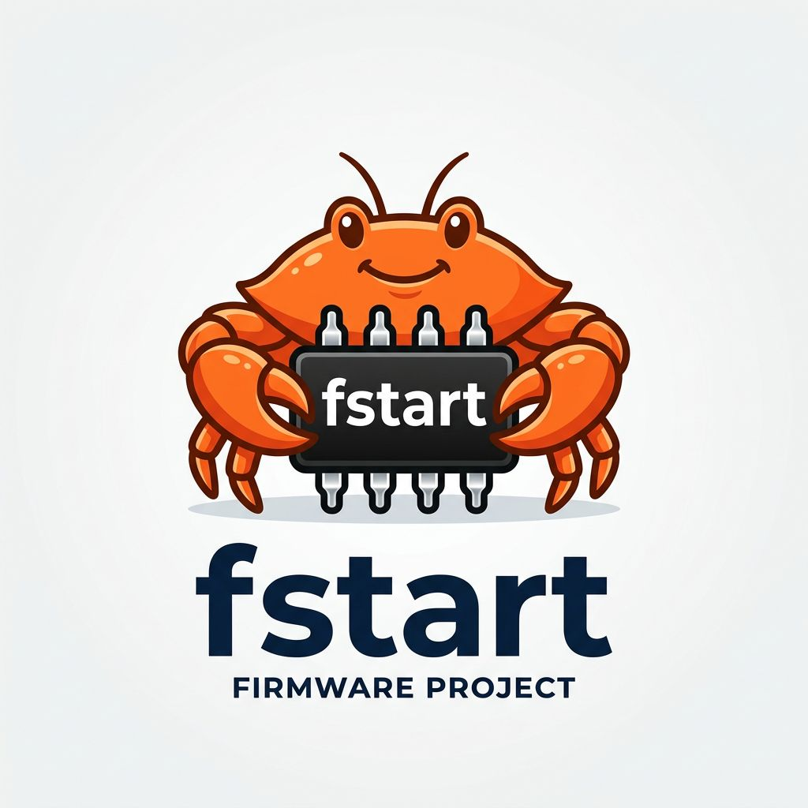

<p align="center">
  
</p>

# fstart

A firmware framework in Rust. You describe a board in a `.ron` file — memory
map, devices, boot sequence — and fstart generates the stage binary, linker
script, and driver initialization automatically. No hand-written stage code.

Supports RISC-V 64, AArch64, and ARMv7. Boots Linux. Runs on QEMU and real
hardware (Allwinner A20).

## Quick start

```bash
# Run a pre-defined board in QEMU
cargo xtask run --board qemu-riscv64
cargo xtask run --board qemu-aarch64

# Build without running
cargo xtask build --board qemu-riscv64

# Build a signed firmware image (FFS)
cargo xtask assemble --board qemu-riscv64
```

## Documentation

- **[User Guide](docs/user-guide.md)** — how to write a board file, available
  drivers, capabilities, and build commands.
- **[Architecture](docs/architecture.md)** — how fstart works: the build
  pipeline, codegen, runtime boot flow, FFS format, and crate structure.
