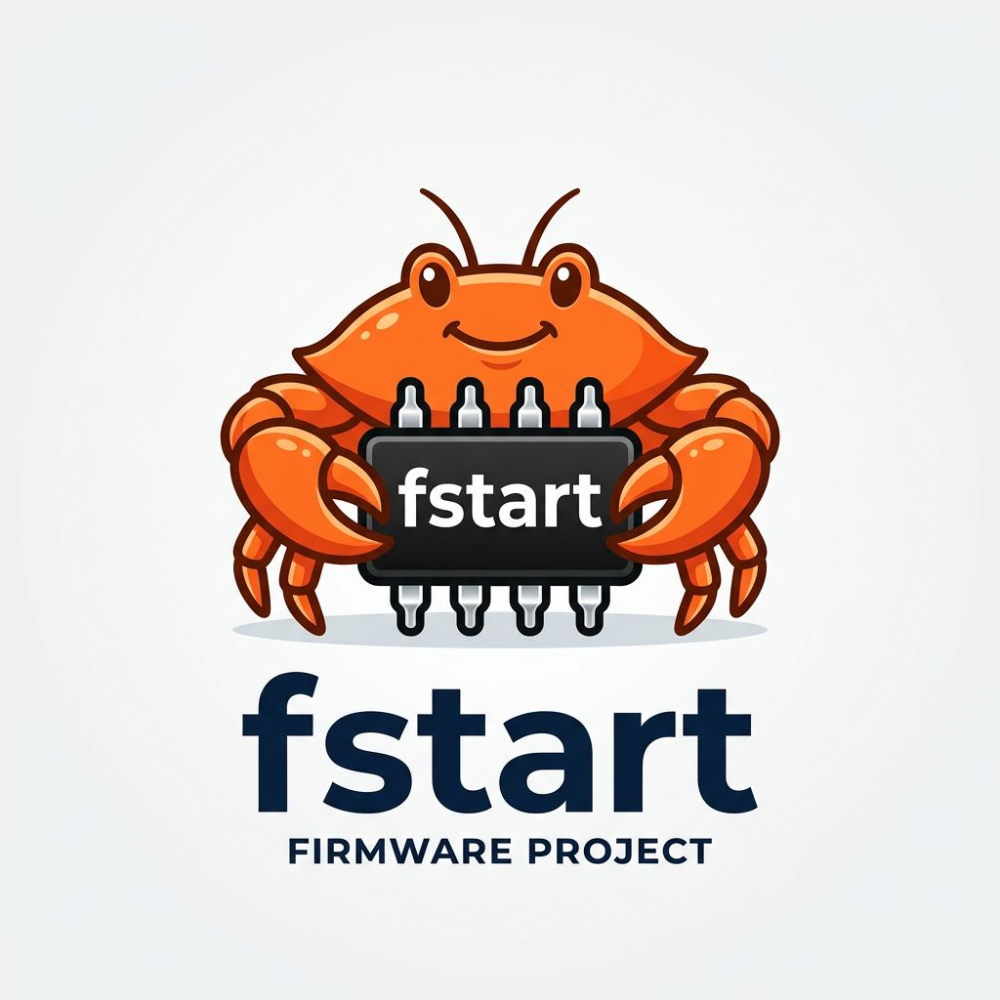

<p align="center">
  
</p>

# fstart

A firmware framework in Rust using Rust board crates with builder-pattern board
metadata, fixed handwritten stage flow, and step-based hardware initialization.

Supports RISC-V 64, AArch64, and ARMv7. Boots Linux. Runs on QEMU and real
hardware (Allwinner A20).

**Experimental.** This is early-stage software. Internals, APIs, and the board
file format may change drastically without notice.

## Quick start

```bash
# Run a pre-defined board in QEMU
cargo xtask run --board qemu-riscv64
cargo xtask run --board qemu-aarch64

# Build without running
cargo xtask build --board qemu-riscv64

# Build a signed firmware image (FFS)
cargo xtask assemble --board qemu-riscv64
```

## Documentation

- **[Rust Board Builder and Fixed Stage Flow Plan](docs/rust-board-builder-stage-flow-plan.md)** — current architecture direction.
